Installation
============

This document describes the installation steps needed to get the
XBeach MI (Multiple Instances) framework to work on a Windows machine
(the screenshots may deviate slightly as they are from a Mac OS X
machine). If you have a working XBeach installation you can skip
step 1. If you have a working Python 2.7 installation with packages
numpy, netCDF4, multiprocessing and mako installed, you can skip
step 2.

1. Download XBeach
------------------

#. Go to http://xbeach.org.

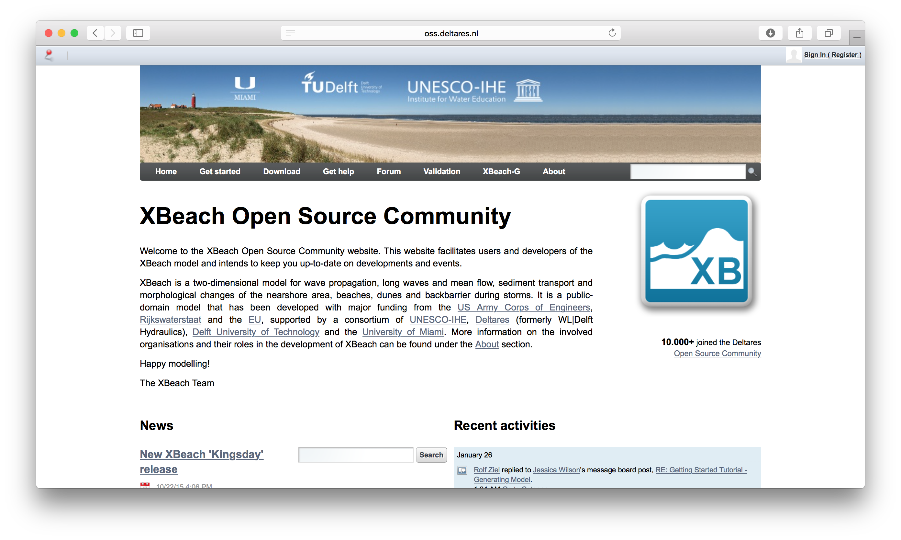
   
#. Choose ``Downloads`` and ``Releases and source``.
   
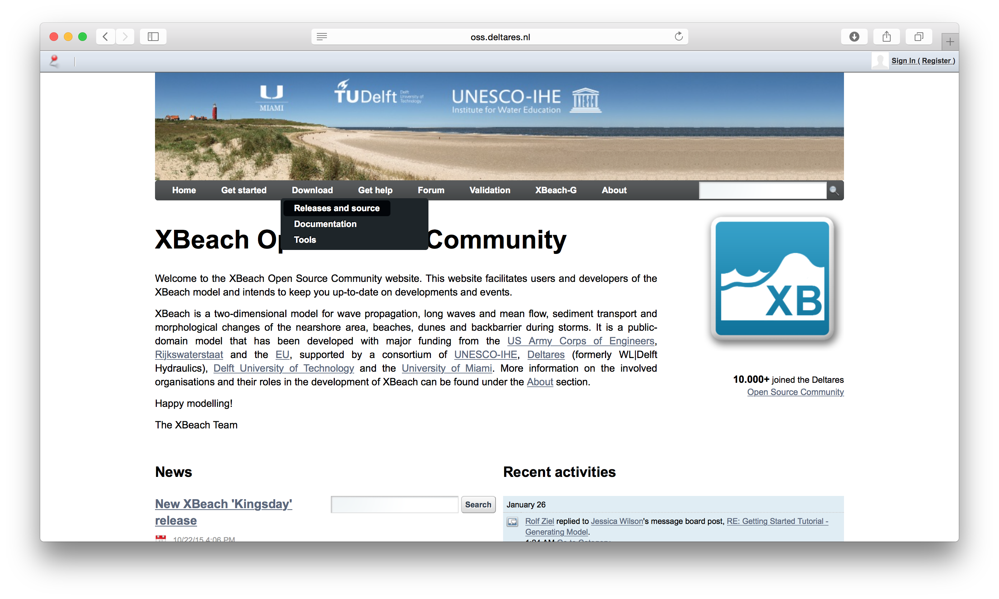

#. Go to ``Daily builds`` and download ``XBeach rev. XXXX (with netCDF
   support)``. You need a recent version of XBeach (rev. >= 4748) that
   implements the Basic Model Interface (BMI).

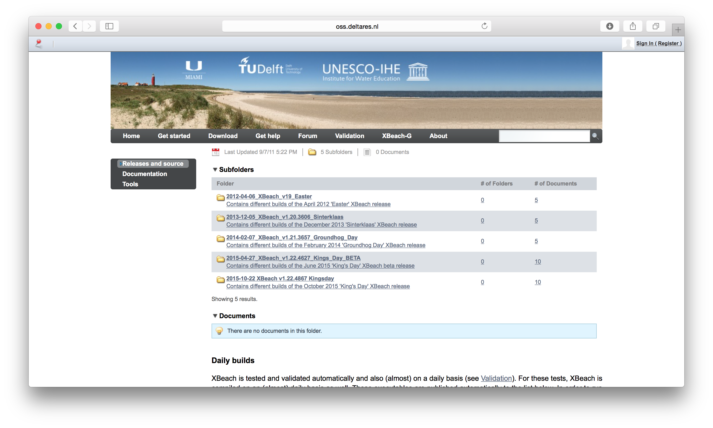
            
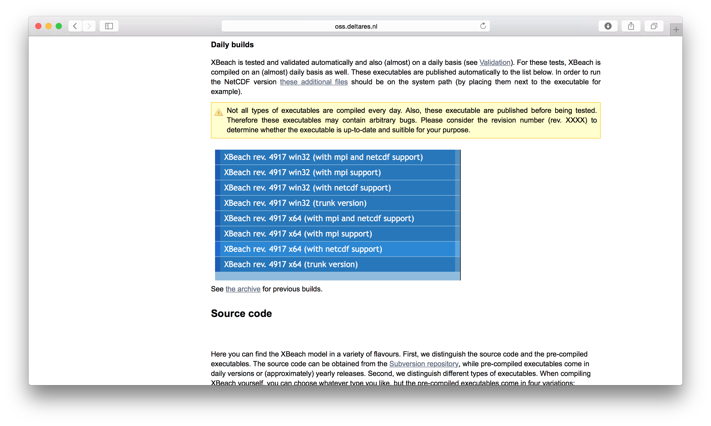
   
2. Download Python
------------------

#. Google for ``Python XY`` (or ``Anaconda``).

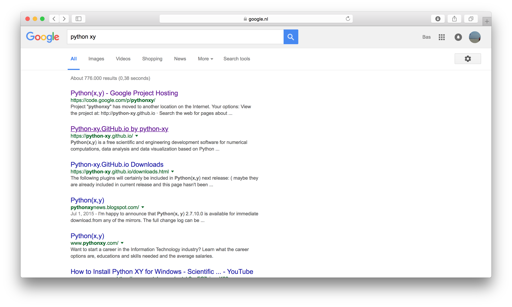
   
#. Follow the instructions to download Python XY (or Anaconda).

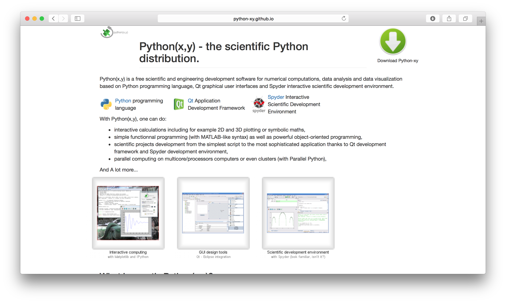
   
#. Follow the instructions to install Python XY (or Anaconda). Do not
   forget to choose ``Full`` install and not the default installation
   configuration.

3. Download BMI and XBeach MI
-----------------------------

#. Go to http://github.com/openearth and search for ``bmi-python``.

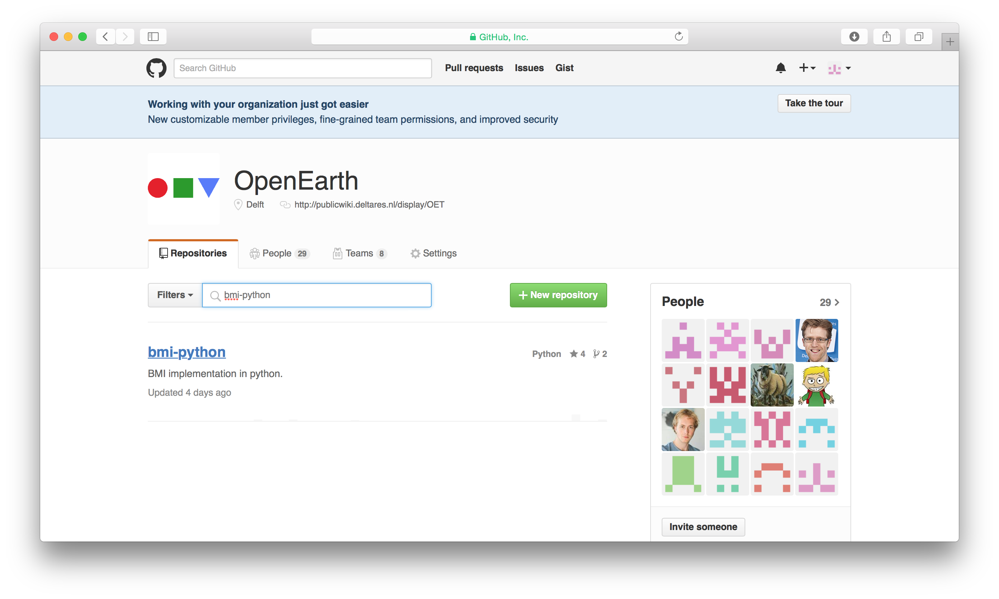
   
#. Choose ``Download ZIP``.

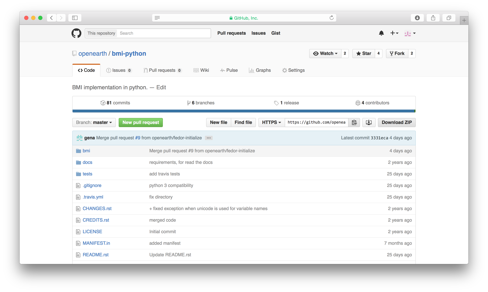
   
#. Go back and search for ``xbeach-mi``.

   
#. Choose ``Download ZIP``.

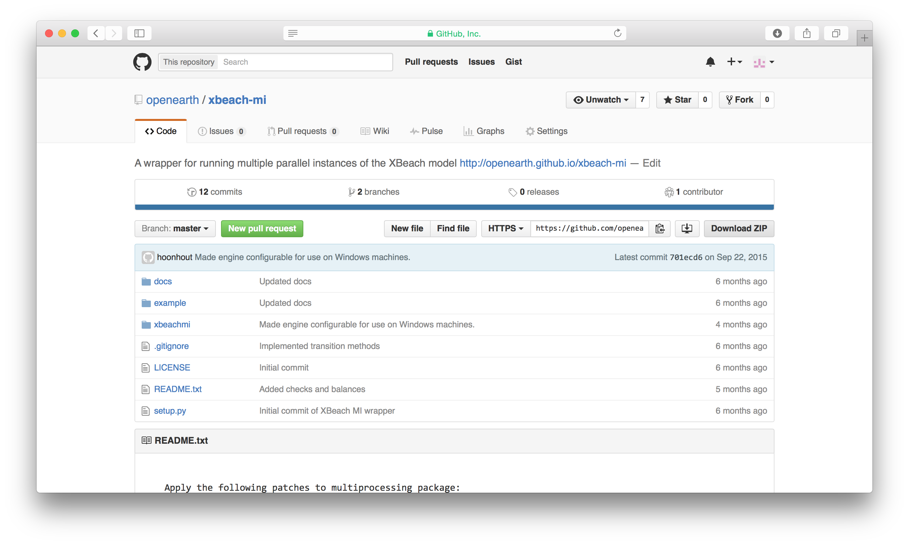
 
4. Install BMI and XBeach MI
----------------------------

#. Unzip the downloaded ``bmi-python`` and ``xbeach-mi`` packages.

#. Go to the command line (Start > ``cmd``).

#. Go to the download directory of the ``bmi-python`` package.

#. Go to the directory that contains the ``setup.py`` file.

#. Run the command ``python setup.py install``.

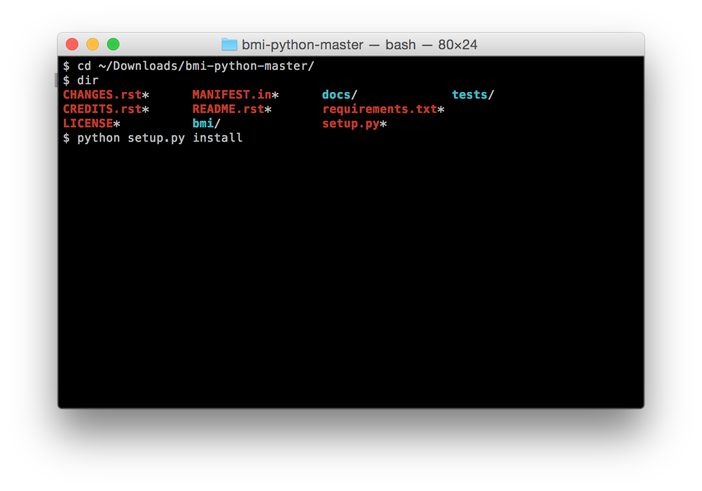

#. Go to the download directory of the ``xbeach-mi`` package that contains the ``setup.py`` file.
   
#. Again, run the command ``python setup.py install``.
 
5. Test XBeach MI
-----------------

#. Test the installation by running the command ``xbeach-mi --help``.

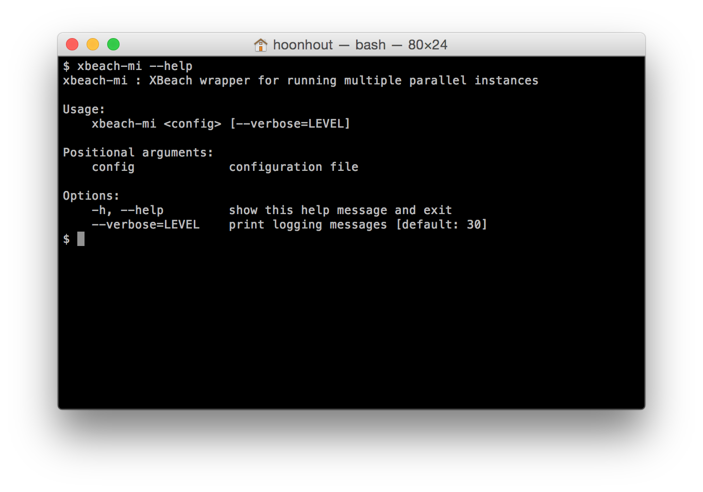
   
#. Go to the ``example`` directory in the ``xbeach-mi`` download directory.
   
#. Run XBeach MI with the provided configuration file.

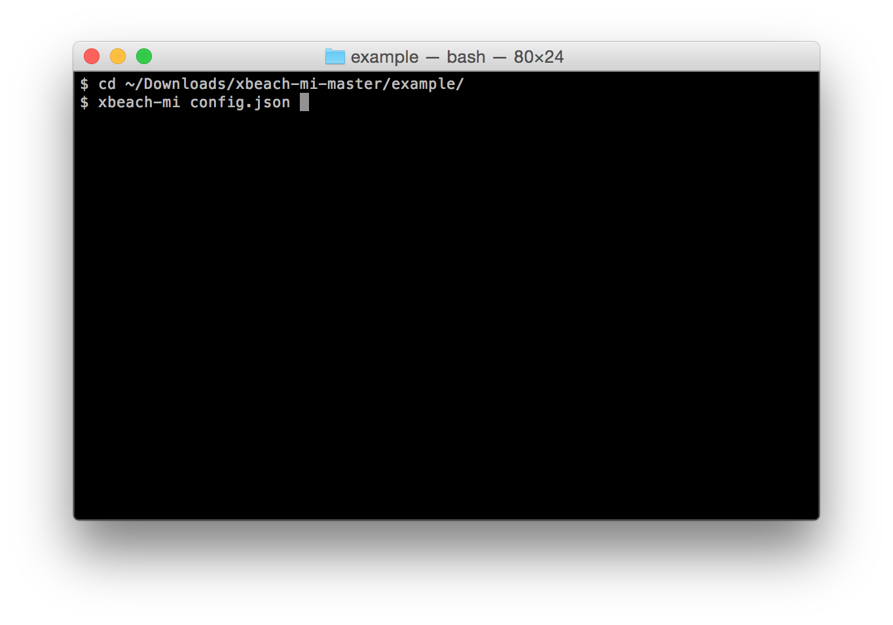

#. Details on configuring and running XBeach MI can be found on the documentation website: examples_

